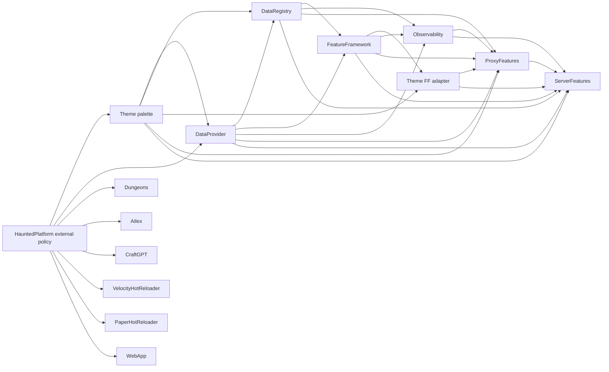

# Release and internal dependency rollout

HauntedPlatform owns shared external dependencies, Paper/Velocity API and runtime versions, Maven plugin versions, and build policy. It does not own internal HauntedMC artifact versions. Each library's root POM declares the internal API versions it compiles against; each application root POM imports the producing libraries' published BOMs and selects its own internal version set.

## Release contract

1. Install the shared CLI version in `tools/release/project.toml` with `gh extension install HauntedMC/gh-haunted-release --pin v1.0.3`. If an older pinned version is installed, remove it first with `gh extension remove haunted-release`. From clean, current `main`, prepare a version PR with `./tools/release/update-version X.Y.Z --pr` for Platform, `./tools/release/update-version patch --pr` for other projects, or `./tools/release/update-version patch --component palette --pr` (or `adapter`) for Theme. Without `--pr`, the command prepares a local diff; `--dry-run` changes nothing. The shared CLI keeps `main` clean during PR preparation and safely retries an existing branch.
2. Merge only after the required `ci-required` check passes, except for the paused applications below. A version change on `main` starts the release workflow. `workflow_dispatch` retries a failed release.
3. The workflow checks the Maven coordinates before deploying. If none exist, it runs the producer's release profiles and acceptance checks, then deploys with `deployAtEnd`. If all exist, it verifies them and finishes tagging without redeployment. If only some exist, it stops and reports missing coordinates. Never overwrite a published version; diagnose a partial publication before retrying.
4. Only after every coordinate resolves from a fresh Maven repository does the workflow create the GitHub Release and tag. Acceptance fixture modules are not deployed.
5. The producer sends `repository_dispatch` to HauntedPlatform with a GitHub App installation token. The reconciler verifies a matching GitHub Release is visible, reads the latest stable releases, and opens or refreshes one bot-owned PR per ready consumer. It waits when an upstream update PR is open or a merged upstream version has not been tagged. PR CI tests the published package. Nothing merges automatically.
6. A merged consumer version bump repeats the same publication gate. This proceeds through the graph without Platform selecting internal versions or a tag racing a downstream PR.

The owner-specific release workflow remains the only publication path. Do not manually push `vX.Y.Z`, `palette-vX.Y.Z`, or `adapter-vX.Y.Z` tags. The release job creates them after verification. An ordinary `main` push without a version change does nothing. Rerunning after a completed tag also does nothing. The GitHub App event is intentionally separate from `GITHUB_TOKEN`, whose events do not trigger other workflows reliably.

## Dependency graph

Platform parent upgrades are proposed to all projects, including independent Dungeons, VelocityHotReloader, PaperHotReloader, AIlex, CraftGPT, and WebApp. The bot starts with Theme palette and DataProvider, then waits for their published updates before preparing dependent projects. A DataProvider API update follows DataRegistry, FeatureFramework, the adapter and Observability, ProxyFeatures, and ServerFeatures. Independent ready branches can advance in parallel. Theme palette and adapter have separate versions and release tags even though they share a repository.

The reconciler uses the fixed `automation/internal-dependencies` branch in each repository and module-specific branches in Theme. A new release refreshes the open PR with all published versions available at that point; a daily scan catches missed notifications. An unchanged scan leaves an aligned PR untouched. It will not propose an unpublished dependency. A consumer keeps its own patch version and test gate; a critical API update therefore needs one patch per affected consumer, without an intermediate Platform release or speculative dependency PR.

## Temporary application Actions pause

GitHub Actions are disabled for private ProxyFeatures, ServerFeatures, and WebApp. The reconciler still opens their dependency update PRs when an upstream package is published, even if an application's current revision is newer than its last GitHub Release. Bot updates open as drafts; the maintainer runs `gh haunted-release verify-pr NUMBER` locally against the exact head commit. The command posts the required `hauntedmc/local-maven` status and marks a passing draft ready. Manually prepared version PRs run local verification before opening and post the same status. A new commit invalidates the earlier result. Merging does not publish an application package, create a release tag, or notify downstream repositories while Actions remain disabled.

## GitHub App and package credentials

Create one organization-owned GitHub App, install it on HauntedPlatform, DataProvider, DataRegistry, FeatureFramework, Theme, HauntedObservability, ProxyFeatures, ServerFeatures, Dungeons, VelocityHotReloader, PaperHotReloader, AIlex, CraftGPT, and WebApp, and grant repository **Contents: read/write** and **Pull requests: read/write**. Add the organization Actions variable `HAUNTEDMC_RELEASE_APP_ID` and organization secret `HAUNTEDMC_RELEASE_APP_PRIVATE_KEY` with access to the producer and HauntedPlatform repositories. The release workflows use the App to dispatch the central updater; the updater uses it to push bot branches and open PRs. Keep `HAUNTEDMC_PACKAGES_USERNAME` and `HAUNTEDMC_PACKAGES_TOKEN` as the separate Maven GitHub Packages credentials. WebApp needs read access for its private parent but does not publish a package while Actions are disabled. The App does not need package publication permission.

Protect `main` in every repository with a required PR, code-owner review, and the appropriate required verification status. Allow the App to push only bot branches, not bypass branch protection. Release publish jobs have explicit `contents: write` for post-publication tag creation; default workflow permissions remain read-only. If App setup or dispatch fails after a package and tag are complete, rerun HauntedPlatform's **Reconcile internal dependency PRs** workflow with the released producer and version; it is idempotent. If a publication fails before the tag, inspect the preflight state and retry the producer workflow after diagnosing the failure.

Merge the WebApp Maven migration before adding WebApp to this reconciler. Select WebApp in the release bot's GitHub App installation before merging the reconciler change; otherwise its graph validation cannot read WebApp's root POM.
