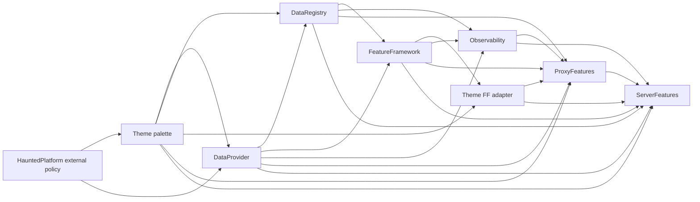

# Release and internal dependency rollout

HauntedPlatform owns shared external dependencies, Paper/Velocity API and runtime versions, Maven plugin versions, and build policy. It does not own internal HauntedMC artifact versions. Each library's root POM declares the internal API versions it compiles against; each application root POM imports the producing libraries' published BOMs and selects its own internal version set.

## Release contract

1. Prepare a semantic version bump in the producer's PR. For Platform, run `scripts/prepare-release.sh X.Y.Z` in a clean worktree. For the other projects, run `./update_version.sh patch` (or `major`/`minor`); Theme uses `./update_version.sh palette patch` or `adapter patch`. The helpers edit files only. Review and merge the PR after its normal CI passes.
2. A version change on `main` starts the release workflow. `workflow_dispatch` can retry a failed release. The workflow runs the producer's release profiles and platform acceptance, deploys the reactor with `deployAtEnd`, and resolves each deployed coordinate from an empty Maven repository. Acceptance fixture modules are not deployed.
3. Only after resolution succeeds does the workflow create the GitHub Release and tag. A partial deploy failure may leave immutable package coordinates; inspect what was published before retrying. Never overwrite a published version. If retry cannot finish the same version, publish a new patch version and document the superseded partial release.
4. The producer sends `repository_dispatch` to HauntedPlatform with a GitHub App installation token. The reconciler verifies a matching GitHub Release is visible, reads the latest stable releases, and opens or refreshes one bot-owned PR per ready consumer. It waits when an upstream update PR is open or a merged upstream version has not been tagged. PR CI tests the published package. Nothing merges automatically.
5. A merged consumer version bump repeats the same publication gate. This proceeds through the graph without Platform selecting internal versions or a tag racing a downstream PR.

The owner-specific release workflow remains the only publication path. Do not manually push `vX.Y.Z`, `palette-vX.Y.Z`, or `adapter-vX.Y.Z` tags. The release job creates them after verification. An ordinary `main` push without a version change does nothing. Rerunning after a completed tag also does nothing. The GitHub App event is intentionally separate from `GITHUB_TOKEN`, whose events do not trigger other workflows reliably.

## Dependency graph

Platform parent upgrades are proposed to all projects, but the bot starts with Theme palette and DataProvider, then waits for their published updates before preparing dependent projects. A DataProvider API update follows DataRegistry, FeatureFramework, the adapter and Observability, ProxyFeatures, and ServerFeatures. Independent ready branches can advance in parallel. Theme palette and adapter have separate versions and release tags even though they share a repository.

The reconciler uses the fixed `automation/internal-dependencies` branch in each repository and module-specific branches in Theme. A new release refreshes the open PR with all published versions available at that point. It will not propose an unpublished dependency. A consumer keeps its own patch version and test gate; a critical API update therefore needs one reviewed patch per affected consumer, without an intermediate Platform release or speculative dependency PR.

## Temporary application Actions pause

GitHub Actions are disabled for ProxyFeatures and ServerFeatures. The reconciler still opens their dependency update PRs when an upstream package is published, even if an application's current revision is newer than its last GitHub Release. Reviewers run `./mvnw -B -ntp verify` locally on each PR branch before merging. Merging those PRs does not publish an application package, create a release tag, or notify downstream repositories while Actions remain disabled. When Actions are restored, reinstate the required checks and remove the local-verification exception from the reconciler.

## GitHub App and package credentials

Create one organization-owned GitHub App, install it on HauntedPlatform, DataProvider, DataRegistry, FeatureFramework, Theme, HauntedObservability, ProxyFeatures, and ServerFeatures, and grant repository **Contents: read/write** and **Pull requests: read/write**. Add the organization Actions variable `HAUNTEDMC_RELEASE_APP_ID` and organization secret `HAUNTEDMC_RELEASE_APP_PRIVATE_KEY` with access to those eight repositories. The release workflows use the App to dispatch the central updater; the updater uses it to push bot branches and open PRs. Keep `HAUNTEDMC_PACKAGES_USERNAME` and `HAUNTEDMC_PACKAGES_TOKEN` as the separate Maven GitHub Packages credentials with read/write package access. The App does not need package publication permission.

Protect `main` in every repository with required PR checks and review. Allow the App to push only bot branches, not bypass branch protection. Because release workflows use `contents: write` for the post-publication tag, the repository's Actions policy must allow tag creation. If App setup or dispatch fails after a package and tag are complete, rerun HauntedPlatform's **Reconcile internal dependency PRs** workflow with the released producer and version; it is idempotent. If a publication fails before the tag, retry the producer workflow after diagnosing the failure.

## 2.0.0 migration order

1. Install the GitHub App and expose its variable and private-key secret to all eight repositories before merging a release workflow. Merge and publish DataProvider 3.4.4 and DataRegistry 1.18.5 BOM additions while they still use the published Platform 1.6.10 parent. Their BOMs manage only their own modules.
2. Merge the Theme split and publish `palette-v1.2.1` before `adapter-v1.2.1`; the adapter depends on the published palette. Theme's CI can build the two-module reactor before either release.
3. Merge the FeatureFramework and HauntedObservability release-workflow changes. These PRs do not bump library versions; they prepare those repositories to publish safely when the reconciler later proposes dependency updates.
4. Merge and publish HauntedPlatform 2.0.0, which removes the internal ecosystem BOM and installs the GitHub App reconciler. Earlier release notifications sent before this workflow exists do not create PRs; the Platform 2.0.0 notification reconciles every latest stable release. The removal is a major version change; 1.6.10 remains available for existing consumers.
5. Let the bot propose parent and internal-version updates in graph order. FeatureFramework and Observability release only when their own consumed API or parent version changes. ProxyFeatures and ServerFeatures require one structural migration PR to import producer BOMs and select their own versions; the reconciler deliberately skips those repositories until the migration is merged. Open those PRs only after 3.4.4, 1.18.5, 1.2.1, and 2.0.0 are published. Then each application publishes its own version, ProxyFeatures before ServerFeatures. Later internal upgrades use the normal bot PR flow.

For a one-off release, use the same graph. The updater may be manually dispatched from HauntedPlatform with a known published producer/version to recover a missed notification. It reconciles current stable releases across the graph, not only the supplied producer.
